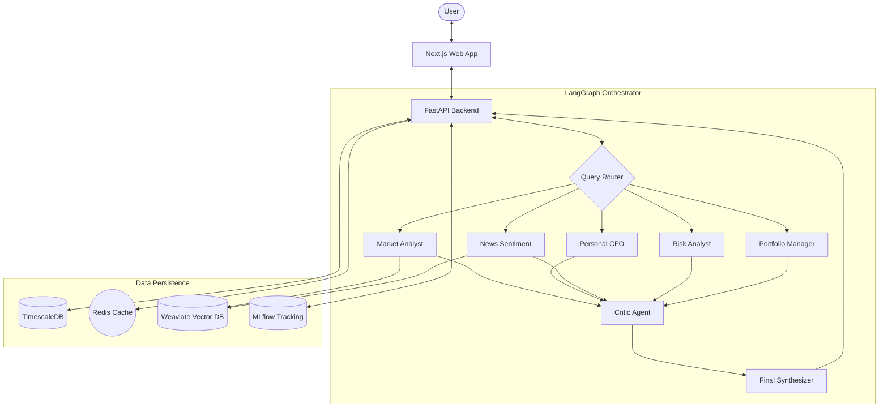

# AI Financial Brain 🧠💰

AI Financial Brain is a cutting-edge, **multi-agent orchestration system** designed to provide comprehensive financial analysis, portfolio management, and market insights. By leveraging **LangGraph** for complex agentic workflows and **Groq** for lightning-fast inference, it transforms raw data into actionable financial intelligence.

[](https://fastapi.tiangolo.com/)
[](https://nextjs.org/)
[](https://python.langchain.com/docs/langgraph)
[](https://groq.com/)

---

## 🌟 Key Features

- **🤖 Multi-Agent Orchestration**: A sophisticated graph-based system where specialized agents collaborate to solve complex financial queries.
- **📈 Comprehensive Financial Agents**:
    - **Market Analyst**: Deep dives into stock trends and technical indicators.
    - **Personal CFO**: Provides tailored budget advice and savings strategies.
    - **News Sentiment**: Analyzes real-time market sentiment from news feeds.
    - **Risk Analyst**: Evaluates portfolio volatility and potential downside risks.
    - **Portfolio Manager**: Suggests asset allocations based on user goals.
    - **Critic Agent**: Validates and refines analysis for maximum accuracy.
- **💾 Long-Term Memory**: Uses **Mem0** to remember user preferences and past interactions across sessions.
- **⚡ Ultra-Fast Inference**: Powered by **Groq Llama 3** models for near-instant responses.
- **🔍 Hybrid Search**: Combines **Weaviate** (vector search) and **TimescaleDB** (structured data) for robust information retrieval.

---

## 🏗 System Architecture



---

## 🛠 Tech Stack

### Backend
- **Core**: Python 3.11, FastAPI
- **AI Framework**: LangChain, LangGraph
- **LLM Provider**: Groq (Llama 3 models)
- **Databases**: 
    - PostgreSQL / TimescaleDB (Relational & Time-series)
    - Redis (Caching & Task Queuing)
    - Weaviate (Vector Database for RAG)
- **Observability**: MLflow, Prometheus, Grafana

### Frontend
- **Framework**: Next.js 14 (App Router)
- **Styling**: Tailwind CSS, Shadcn UI
- **Language**: TypeScript

---

## 🚀 Getting Started

### Prerequisites
- Docker & Docker Compose
- Python 3.11+
- Node.js 18+

### 1. Clone the Repository
```bash
git clone https://github.com/your-username/ai-financial-brain.git
cd ai-financial-brain
```

### 2. Environment Configuration
Copy the `.env.example` (if available) or create a `.env` file in the root directory:

```env
# LLM Configuration
LLM_PROVIDER=groq
GROQ_API_KEY=your_groq_api_key_here
GROQ_MODEL=llama-3.1-8b-instant

# Database Configuration
POSTGRES_PASSWORD=your_secure_password
REDIS_PASSWORD=your_redis_password
```

### 3. Running with Docker (Recommended)
Launch the entire stack (Database, Cache, Vector DB, MLflow):
```bash
docker compose -f deployments/docker/docker-compose.yml up -d
```

### 4. Running Backend Locally
```bash
cd backend
python -m venv venv
source venv/bin/activate  # Windows: venv\Scripts\activate
pip install -r requirements.txt
python main.py
```

### 5. Running Frontend Locally
```bash
cd frontend
npm install
npm run dev
```

---

## 📂 Project Structure

- `backend/`: FastAPI application, LangGraph agents, and services.
- `frontend/`: Next.js web application.
- `deployments/`: Docker icons and deployment configurations.
- `pipelines/`: Data ingestion and ML training pipelines.
- `docs/`: Technical documentation and API specs.

---

## 🛡 Disclaimer
*This system is for educational and informational purposes only. It does NOT provide certified financial advice. Always consult with a professional financial advisor before making any investment decisions.*

---
Developed with ❤️ by the AI Financial Brain Team.
